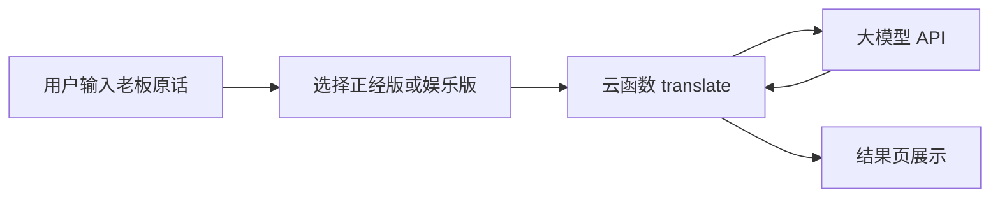

# 老板需求翻译器 — 微信小程序实现计划

## 产品定位

| 模式 | 输入 | 输出风格 |
|------|------|----------|
| 正经版 | 老板原话 | 拆解真实诉求、隐含优先级、可执行动作，语气专业克制 |
| 娱乐版 | 老板原话 | 职场梗 + 幽默吐槽，点出痛点，但不人身攻击、不涉政敏感 |

核心流程：**输入 → 选模式 → 云函数调 LLM → 展示结果 →（可选）复制/分享/历史**



---

## 技术选型（已确认）

- **前端**：微信小程序原生（`WXML` + `WXSS` + `JS/TS`），结构简单、审核友好
- **后端**：[微信云开发](https://developers.weixin.qq.com/miniprogram/dev/wxcloud/basis/getting-started.html)
  - **云函数**：封装 LLM 调用、Prompt、限流与错误处理
  - **云数据库**（二期）：存翻译历史（openid 维度）
- **模型**：建议首期 **DeepSeek** 或 **通义千问**（国内延迟低、成本低）；通过云函数环境变量配置 `API_KEY`、`BASE_URL`、`MODEL`，便于切换

密钥**绝不**写入小程序客户端，只放在云函数环境变量中。

---

## 项目目录结构（建议）

```
boss-quest-translator-cursor/
├── miniprogram/
│   ├── app.js / app.json / app.wxss
│   ├── pages/
│   │   ├── index/          # 首页：输入 + 模式切换 + 翻译按钮
│   │   └── result/         # 结果页：展示 + 复制 + 再译一条
│   ├── components/
│   │   └── mode-switch/    # 正经版 / 娱乐版 Tab
│   └── utils/
│       └── cloud.js        # 封装 wx.cloud.callFunction
├── cloudfunctions/
│   └── translate/
│       ├── index.js        # 主逻辑：校验入参 → 拼 Prompt → 调 API → 返回
│       ├── prompts.js      # 两套 System/User Prompt 模板
│       └── package.json
├── project.config.json     # 小程序 AppID、云开发根目录
└── README.md               # 开通云开发、配置密钥、上传云函数步骤
```

---

## 页面与交互（MVP）

### 1. 首页 [`miniprogram/pages/index`](miniprogram/pages/index)

- 顶部：产品名 + 一句话 Slogan（如「听懂老板，少踩坑」）
- **模式切换**：Segmented Control — `正经版` | `娱乐版`（默认正经版）
- **多行输入框**：placeholder 示例（「这个需求很简单，周末加一下」）
- **翻译按钮**：loading 态、防重复点击（3s 内禁用）
- 底部：免责声明（娱乐版注明「仅供吐槽，勿对号入座」）

### 2. 结果页 [`miniprogram/pages/result`](miniprogram/pages/result)

- 展示：原话摘要 + 翻译结果（支持分段：真实意图 / 潜台词 / 建议你怎么回）
- 操作：**复制全文**、**换一条**（返回首页并保留输入）、**分享**（`onShareAppMessage`，分享卡片带模式标签）

### 3. 全局 [`miniprogram/app.js`](miniprogram/app.js)

- `onLaunch` 中 `wx.cloud.init({ env: '你的环境ID' })`
- 统一错误 Toast（网络失败、内容过长、服务繁忙）

---

## 云函数设计 [`cloudfunctions/translate`](cloudfunctions/translate)

### 入参

```js
{ text: string, mode: 'serious' | 'fun', maxLength?: number }
```

### 出参

```js
{ success: true, data: { intent, subtext?, suggestion?, raw } }
// 或 { success: false, code, message }
```

### 校验与安全

- `text` 非空，长度上限 **500 字**（可配置）
- 云函数侧做简单敏感词拦截（可选库或关键词表）；失败返回友好提示
- 单用户 **频率限制**：云数据库存 `rate_limit` 集合，或云函数内存 + openid，MVP 可先 **每用户每分钟 5 次**

### Prompt 策略（核心差异化）

在 [`prompts.js`](cloudfunctions/translate/prompts.js) 维护两套 **System Prompt**：

**正经版要点**

- 角色：资深 PM / 职场沟通教练
- 输出结构（要求 JSON 或固定 Markdown 小节，便于前端解析）：
  - `真实意图`：老板真正要什么
  - `隐含优先级`：时间/质量/成本倾向
  - `风险点`：模糊处、背锅点
  - `建议回应`：1～2 句可直接回复老板的话术

**娱乐版要点**

- 角色：懂梗的职场老油条
- 风格：幽默、共鸣职场痛点，可用网络用语但**禁止**辱骂、歧视、政治、色情
- 输出结构：
  - `翻译版人话`
  - `内心 OS`（括号吐槽）
  - `生存建议`（一句梗式建议）

两套共用同一 `user` 模板：`老板原话：「{text}」`，仅切换 system。

### LLM 调用

- 使用 `https` 请求 OpenAI 兼容接口（DeepSeek / 通义均支持）
- `temperature`：正经版 `0.3`，娱乐版 `0.8`
- 超时 25s，失败重试 1 次
- 返回后若模型未按 JSON 输出，用正则兜底提取或整段作为 `raw` 展示

---

## 配置与上线 checklist

1. [微信公众平台](https://mp.weixin.qq.com/) 注册小程序，获取 **AppID**
2. 开发者工具开通 **云开发**，创建环境，记下 `env`
3. 云函数 → 配置环境变量：`LLM_API_KEY`、`LLM_BASE_URL`、`LLM_MODEL`
4. 右键云函数目录 → **上传并部署：云端安装依赖**
5. 小程序后台配置：**用户隐私保护指引**（若收集输入内容需说明用途）、**服务类目**（工具类）
6. 娱乐版提交审核时，在说明中强调内容为虚构幽默、无攻击性

---

## 二期扩展（不在 MVP，但预留接口）

| 功能 | 实现思路 |
|------|----------|
| 历史记录 | 云库 `translations`：`openid, text, mode, result, createdAt` |
| 收藏/分享海报 | `canvas` 生成梗图 |
| 多模型切换 | 云函数入参 `provider`，管理后台配置 |
| 订阅消息 | 翻译完成通知（非必需） |

---

## 成本与性能粗估

- 单次翻译约 500～1500 tokens；DeepSeek 级别约 **0.001～0.01 元/次**
- 云开发免费额度内个人试用足够；流量大后再买资源包

---

## 开发顺序（建议 3～4 天 MVP）

1. **Day 1**：初始化小程序 + 云开发；首页 UI + 模式切换；云函数骨架 + 正经版 Prompt 联调通
2. **Day 2**：娱乐版 Prompt 调优；结果页 + 复制；错误与 loading 态
3. **Day 3**：限流、长度校验、敏感词；分享；README 与 env 配置文档
4. **Day 4**：真机预览、文案润色、提交体验版内测

---

## 风险与对策

- **审核**：娱乐版避免真实公司/真人；加免责声明
- **模型胡说**：正经版要求「不确定则标注假设」；娱乐版加「仅供娱乐」
- **API 不可用**：云函数返回固定友好文案 + 错误码，前端提示稍后重试
